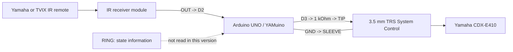

# YAMuino

[](https://github.com/johnlenfr/YAMuino/actions/workflows/arduino-build.yml)

**YAMuino** is an Arduino UNO infrared bridge for controlling a Yamaha CDX-E410 CD player without the matching RX-E410 receiver/amplifier.

The project receives NEC infrared commands from either the original Yamaha remote or a supported TVIX DVICO remote, translates them when required, and sends a demodulated NEC command stream to the CD player's **System Control** input.

## Features

- Controls a Yamaha CDX-E410 directly through its System Control RX command line.
- Supports the original Yamaha NEC remote command set used by the project.
- Supports a TVIX DVICO NEC remote through an explicit command mapping.
- Implements Play / Pause / Resume behavior with an internal software state.
- Implements Power On / Standby command remapping.
- Cycles display brightness through Bright -> Dimmed -> Off -> Bright.
- Filters most NEC repeat frames to reduce accidental double actions.
- Keeps the firmware intentionally small and compatible with Arduino UNO.

## Hardware overview



### Arduino pin assignment

| Arduino UNO pin | Function |
| --- | --- |
| D2 | IR receiver output (`IR_PIN`) |
| D3 | Yamaha System Control RX command output (`OUT_PIN`) |
| GND | TRS sleeve / common ground |
| D0 / D1 | Serial RX/TX, used only when debug output is enabled |

### TRS connection used by this project

| TRS contact | Yamaha function | YAMuino connection |
| --- | --- | --- |
| TIP | RX command line | Arduino D3 through 1 kOhm series resistor |
| RING | State information line | Not connected in the current version |
| SLEEVE | Ground | Arduino GND |

> [!CAUTION]
> The direct D3-to-System-Control connection is the wiring reported as working for the original project. Verify the electrical levels and wiring of your own hardware before connecting it. Disconnect power while changing wiring. The project does not claim compatibility with other Yamaha models.

## Software requirements

- Arduino UNO
- Arduino IDE 2.x or Arduino CLI
- `IRremote` library using the modern `IRremote.hpp` API

The source header records Arduino IDE **2.3.6** as the development environment used for the supplied firmware.

## Quick start

1. Clone or copy this repository into `D:\Github\YAMuino`.
2. Install the Arduino AVR board support package in Arduino IDE.
3. Install the **IRremote** library using the Arduino Library Manager.
4. Open `YAMuino.ino`.
5. Select **Arduino UNO** and the correct serial port.
6. Compile and upload the sketch.
7. Wire the IR receiver to D2 and the Yamaha command line to D3 through the 1 kOhm resistor.
8. Test with the CD player first in a known stopped and powered-on state.

For complete setup details, see [docs/MANUAL.md](docs/MANUAL.md).

## Documentation

| Document | Purpose |
| --- | --- |
| [User and installation manual](docs/MANUAL.md) | Complete installation, operation, limitations and maintenance guide |
| [Wiring guide](docs/WIRING.md) | Arduino, IR receiver and TRS wiring details |
| [Protocol notes](docs/PROTOCOL.md) | NEC frame format and Yamaha System Control behavior |
| [Remote mapping](docs/REMOTE_MAPPING.md) | Yamaha and TVIX command tables |
| [Troubleshooting](docs/TROUBLESHOOTING.md) | Common hardware and software problems |
| [Development guide](docs/DEVELOPMENT.md) | Building, debugging and extending the firmware |
| [GitHub Desktop publishing](docs/GITHUB_DESKTOP.md) | Publishing from `D:\Github` to `johnlenfr/YAMuino` |
| [Third-party notes](docs/THIRD_PARTY.md) | External library, trademarks and service-manual handling |
| [Changelog](CHANGELOG.md) | Repository and firmware history |

## How it works

The Yamaha service documentation describes the System Control RX command line as a **demodulated NEC remote-control signal**. YAMuino reproduces the required NEC timing in software and transmits the Yamaha custom code `0x78` followed by the selected command.

The firmware receives IR frames on D2 using the `IRremote` library. Frames from Yamaha address `0x78` are handled directly. Frames from TVIX address `0xFD00` are mapped to equivalent Yamaha commands before transmission.

The current firmware does **not** read the System Control state-information line on the TRS ring. Power, playback and display states are therefore partly tracked in software and can become out of sync if the CD player's front-panel controls are used.

## Debug mode

Debug output is disabled by default:

```cpp
#define DEBUG 0
```

Change it to `1`, upload the sketch again, and open the Serial Monitor at **115200 baud** to inspect received protocol, address, command and repeat flags.

## Repository status

This repository packaging is based on the supplied `yamaha_v4.ino` firmware and the Yamaha CDX-E410 service documentation supplied with the project.

The original Yamaha service manual is retained only in the local `reference-local/` directory of this prepared package. That directory is ignored by Git and is not intended to be published automatically.

## License

No open-source license has been selected for this prepared repository. Until the repository owner adds a license, normal copyright rules apply to the project code and documentation. See [docs/THIRD_PARTY.md](docs/THIRD_PARTY.md) for third-party material.
